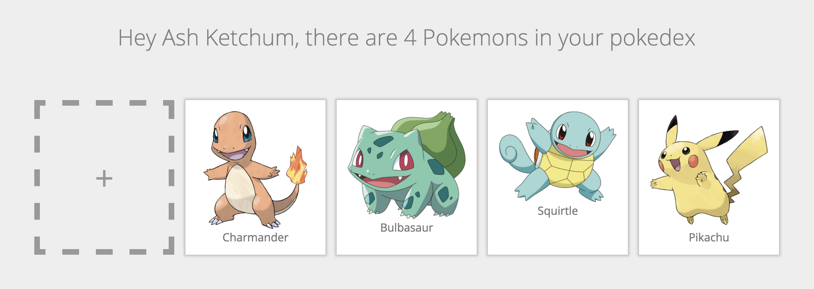

# Introduction

Welcome to *Learn Apollo*, a hands-on tutorial for Apollo Client where you take a journey from a basic starter-kit application to a complete pokedex application!

<iframe width="560" height="315" src="https://www.youtube.com/embed/Ai041BtmH2c" frameborder="0" allowfullscreen></iframe>

## Goals

* Understand what Apollo Client handles for you
* Learn how to build a realistic Apollo Client application from start to finish in an interactive and fun way
* Expand your understanding on different concepts through separate excursions
* Access further resources and be able to enrich the community

## The pokedex application

Before you are ready with working on the pokedex application, we have to set you up with the necessary tools.

## The tutorial structure

We offer different so called *tutorial tracks* to work on the Pokedex application. Choose between React, React Native Vanilla,
React Native Exponent. More tracks, such as for Angular 2, iOS and Vue.js are planned. You can choose whatever you feel most comfortable with or try out something new. Each exercise builds upon the previous one and features individual steps to finish it. And if you're not sure how to best approach a task, just take a sneak peek at the solution folder or drop by at our [Slack channel](http://slack.graph.cool)!

Exercises and solutions are available in separate folders in the provided zip file so you can easily switch
between and compare different exercises and solutions.

Apart from the self-contained Apollo tutorial, we plan to offer a few selected excursions that will zoom in on more specific
topics such as the *Redux DevTools* or *optimistic UI*. The excursions are not necessary to finish the exercises, but
can teach you a trick or two or give you a better understanding of specific concepts.

## Environment setup

You only need [Node](https://nodejs.org) and a Node package manager like [yarn](https://yarnpkg.com/en/docs/install)
or [npm](https://www.npmjs.com/) to get started with working on the Pokedex application. Usually, Apollo Client
requires you to set up a GraphQL server on your own. However we already prepared your own GraphQL server and set it up
properly for you, if you sign in with Github.

This means you can start working on the pokedex application without worrying about configuring your
own GraphQL server. Request your individual GraphQL endpoint and receive an integrated GraphQL Server console
right in your browser!

<!-- __INJECT_GRAPHQL_ENDPOINT__ -->
