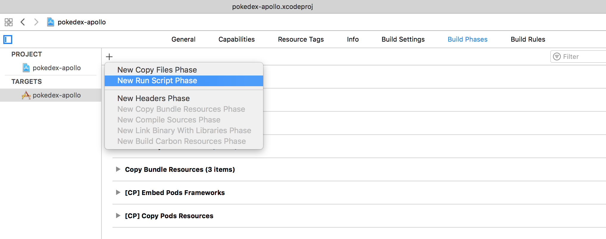
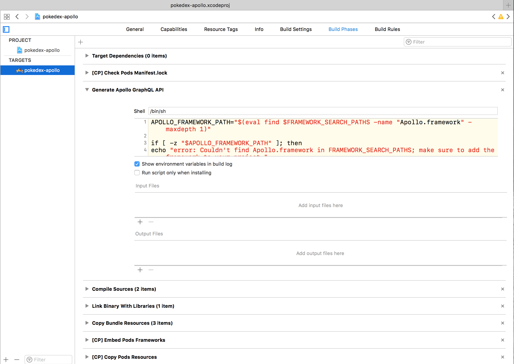

# Tutorial 01 - Getting Started

Welcome to the 1st exercise in the **iOS** Track of this Apollo Client Tutorial! If you prefer React, React Native, Angular 2 or Vue.js over iOS, head over to the respective tutorial track.

> Note: This tutorial assumes a basic familiarity with GraphQL and focusses on functionality of the [**Apollo iOS Client**](http://dev.apollodata.com/ios/). If you want to learn more about the used GraphQL concepts, visit [learngraphql](www.learngraphql.com).

## Goal

The **goal** of this exercise is to get your environment set up so you can use the **Apollo iOS Client** in Xcode. 

By the end of this exercise you will have a running Xcode project in which you can use the **Apollo iOS Client**. The app will display a generic greeting in a table view, telling you that you don't have any Pokemons in your Pokedex yet.


## Introduction

Sign up with GitHub to receive your own `pokedex-apollo` project here:

<!-- __DOWNLOAD_IOS__ -->

Now change to the folder that contains the 1st exercise (`exercise-01`) and open `pokedex-apollo.xcworkspace`. We need to use the `.xcworkspace` file because we are using Cocoapods for managing dependencies. 

As you can see, there is already one dependency included in the project. This dependency is [Alamofire](https://github.com/Alamofire/Alamofire), which we are going to use to make networking calls to fetch the images for our Pokemons.

The app so far only consists of one table view controller that will display two _sections_. The first section right now only contains a generic greeting from the prototype cell in Storyboard, the second section will be used to actually display the Pokemons you catch.


## Installing The **Apollo iOS Client** With Cocoapods

The **Apollo iOS client** can be installed through Cocoapods or Carthage. Since we are using Cocoapods in this project, go ahead and open the `Podfile` and add the following line:

```ruby
pod 'Apollo'
```

After you executed this step, navigate to the root directory of the project in a terminal and run `pod install`.


## Setting Up The Apollo Environment

Unlike most other dependencies that are installed with Cocoapods, we are not quite done with setting up the environment after running `pod install`. That is because the **Apollo iOS client** depends on an additional tool called `apollo-codegen`. With every time you build the Xcode project, this tool needs to run before the actual compilation process. The reason for this is that the tool will scan your project for any `.graphql` files and generate a Swift file called `API.swift` which contains your GraphQL types. A major advantage of this approach is that we can leverage the Swift type system to make sure we are only querying data that we need, and the compiler will catch any potential issues for us before runtime.

> Note: The [Apollo iOS Guide](http://dev.apollodata.com/ios/index.html) also contains detailled information about setup and usage of the **Apollo iOS client**.


### Install `apollo-codegen`

You first need to globally install `apollo-codegen` on your machine using the _node package manager_ (npm) with the following command:

```bash
npm install -g apollo-codegen
```

### Adding A Build Phase

The next step is adding a _Build Phase_ to the Xcode project. Execute the following instructions to do so:

1. Select the **apollo-pokedex** project in the _Project Navigator_
2. Select the only application target called **apollo-pokedex**
3. Select the **Build Phases** tab on top
4. Click the **+** button on the top left
5. Select **New Run Script Phase** from the menu that pops up
  
6. Rename the newly added build phase to _Generate Apollo GraphQL API_
7. Drag and drop the build phase to a new position right before **Compile Sources**
8. Copy the following code snippet into the field that currently says: _Type a script or drag a script file from your workspace to insert its path_
  ```bash
  APOLLO_FRAMEWORK_PATH="$(eval find $FRAMEWORK_SEARCH_PATHS -name "Apollo.framework" -maxdepth 1)"

  if [ -z "$APOLLO_FRAMEWORK_PATH" ]; then
    echo "error: Couldn't find Apollo.framework in FRAMEWORK_SEARCH_PATHS; make sure to add the framework to your project."
    exit 1
  fi

  cd "${SRCROOT}/${TARGET_NAME}"
  $APOLLO_FRAMEWORK_PATH/check-and-run-apollo-codegen.sh generate $(find . -name '*.graphql') --schema schema.json --output API.swift
  ```
9. This code will now run `apollo-codegen` before compilation and generate a file called `API.swift`. Verify your settings look like this:
  

> From the [Apollo iOS Guide](http://dev.apollodata.com/ios/installation.html): _The script above will invoke `apollo-codegen` through the `check-and-run-apollo-codegen.sh` wrapper script, which is actually contained in the `Apollo.framework` bundle. The main reason for this is to check whether the version of `apollo-codegen` installed on your system is compatible with the framework version installed in your project, and to warn you if it isn’t. Without this check, you could end up generating code that is incompatible with the runtime code contained in the framework._

If you already built the project you might have noticed that the promised `API.swift` file has already been generated. However, it only exists on the file system in the root directory of your project and is not part of the actual Xcode project yet (we'll take care of that in the next exercise). Also, the file is still empty because we didn't add any GraphQL queries or mutations yet, so there is nothing to generate.

> Note: When you're setting up your _own_ Apollo project, you'll have to provide a `schema.json` file that contains the GraphQL schema you want to use. In this tutorial, we included that file for you already. Find more info about how to generate this file [here](http://dev.apollodata.com/ios/downloading-schema.html).


## Instantiate The Apollo Client

Next, we want to instantiate the `ApolloClient` so that we can start making requests against our GraphQL API. For the purpose of this tutorial, we will create a global instance of the `ApolloClient` in `AppDelegate.swift`. Therefore, we first need to import the `Apollo` framework with `import Apollo` (which you can add directly below `import UIKit`):

```swift@AppDelegate.swift
import Apollo
```

Then add the following two lines after the import statements:

```swift@AppDelegate.swift
let graphlQLEndpointURL = "https://api.graph.cool/simple/v1/__PROJECT_ID__"
let apollo = ApolloClient(url: URL(string: graphlQLEndpointURL)!)
```

Make sure you use the correct URL that represents your Pokedex sandbox. If you signed in via GitHub, the project ID in the URL should have been set for you automatically. 

The `ApolloClient` we instantiated above can now be used for two different things:
- fetching data with [queries]((http://dev.apollodata.com/ios/queries.html#fetching-queries)) (using its `fetch` method) 
- updating data with [mutations](http://dev.apollodata.com/ios/mutations.html) (using its `perform` method)

That's it for this lesson! Make sure everything is set up properly until this point by running the project in a simulator. 


## Recap

In this lesson, we learned how to configure the environment and set up the **Apollo iOS client**:

- The **Apollo iOS client** can be installed via Cocoapods or Carthage
- Its usage however requires some further configuration: 
  - Adding a build phase to invoke `apollo-codegen`
  - Having the `schema.json` file available in your project
- `apollo-codegen` will run at every build before compilation and generate `API.swift` that contains all your GraphQL types


